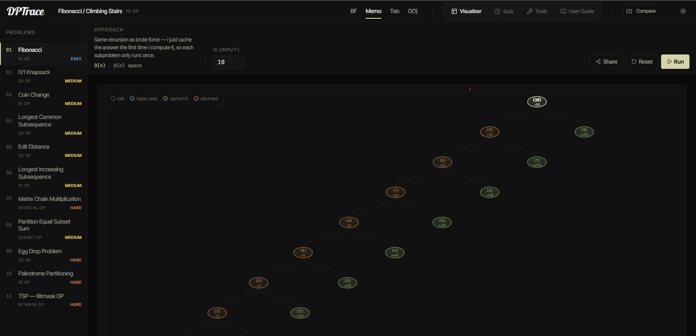
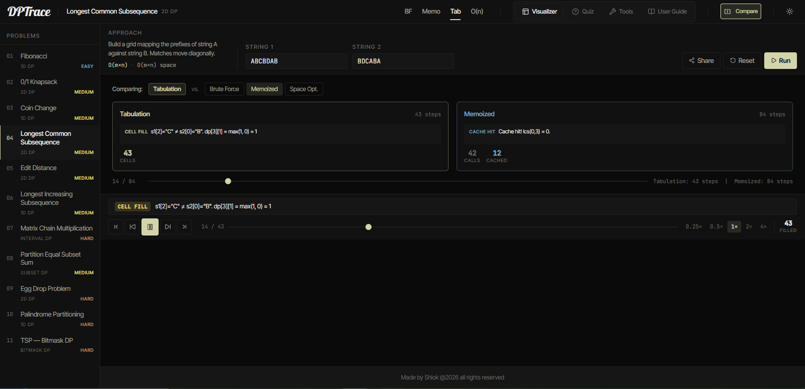
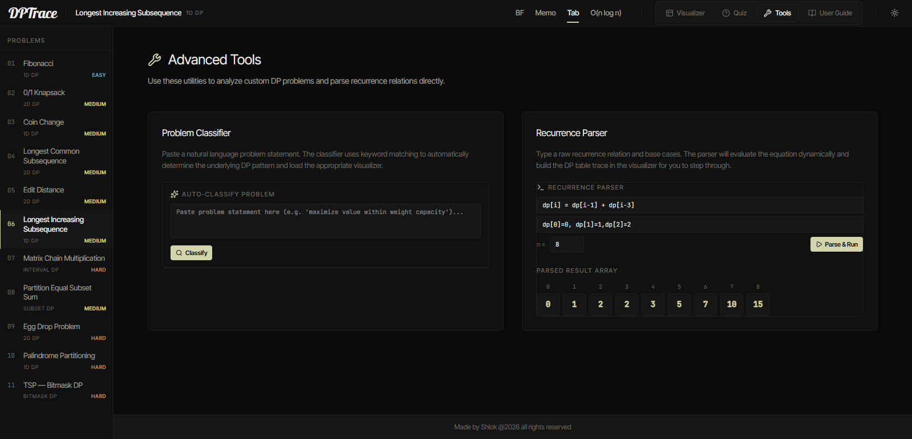

# DPTrace

**Live Demo:** [https://dp-trace.vercel.app/](https://dp-trace.vercel.app/)

> An interactive, step-by-step visualizer for Dynamic Programming algorithms. Trace execution, compare approaches, quiz yourself, and build your own recurrences — all in the browser.

---

## 📸 Demo

### Step-by-step Visualizer

### Compare Mode — Side by Side

### Recurrence Parser

---

## How to Use

| Feature | Where to find it |
| :--- | :--- |
| Step through an algorithm | **Visualizer** tab → pick a problem → click **Run** → use the scrubber or arrow keys |
| Compare two approaches | **Visualizer** tab → click **Compare** in the header |
| Test a custom input | Left panel → edit the input fields → click **Run** |
| Classify a word problem | **Tools** tab → paste problem statement → **Classify** |
| Build a custom recurrence | **Tools** tab → Recurrence Parser |
| Take a quiz | **Quiz** tab |
| Share your test case | Left panel → **Share** button — copies a URL with your full state |

**Keyboard shortcuts:** `Space` play/pause · `←` step back · `→` step forward

---

## Supported Problems

11 classic DP problems, each with 4 fully animated approaches (Brute Force → Memoized → Tabulation → Space Optimized):

| # | Problem | Pattern | Difficulty |
|---|---------|------|---|
| 01 | Fibonacci Sequence | 1D DP | Easy |
| 02 | 0/1 Knapsack | 2D DP | Medium |
| 03 | Coin Change | 1D DP | Medium |
| 04 | Longest Common Subsequence | 2D DP | Medium |
| 05 | Edit Distance | 2D DP | Hard |
| 06 | Longest Increasing Subsequence | 1D DP | Medium |
| 07 | Matrix Chain Multiplication | Interval DP | Hard |
| 08 | Partition Equal Subset Sum | Subset DP | Medium |
| 09 | Egg Drop Problem | 2D DP | Hard |
| 10 | Palindrome Partitioning | 1D DP | Hard |
| 11 | TSP — Bitmask DP | Bitmask DP | Hard |

---

## Tech Stack

| Layer | Technology | Why |
| :--- | :--- | :--- |
| **UI Framework** | React | Component model maps cleanly onto the panel-based layout; hooks make step subscriptions trivial |
| **State** | Zustand | Zero boilerplate, no context providers, fine-grained subscriptions — critical for keeping the playback scrubber performant |
| **Build Tool** | Vite | Sub-second HMR made iterating on algorithm trace output fast; native ESM means no config overhead |
| **Styling** | Vanilla CSS | Full control over CSS variables for the dark/light theme system without runtime overhead of a CSS-in-JS library |
| **Icons** | Lucide React | Consistent stroke-width icon set that scales cleanly at the 14–18px sizes used throughout the UI |

---

## License

Made by Shlok &copy; 2026. All rights reserved.
